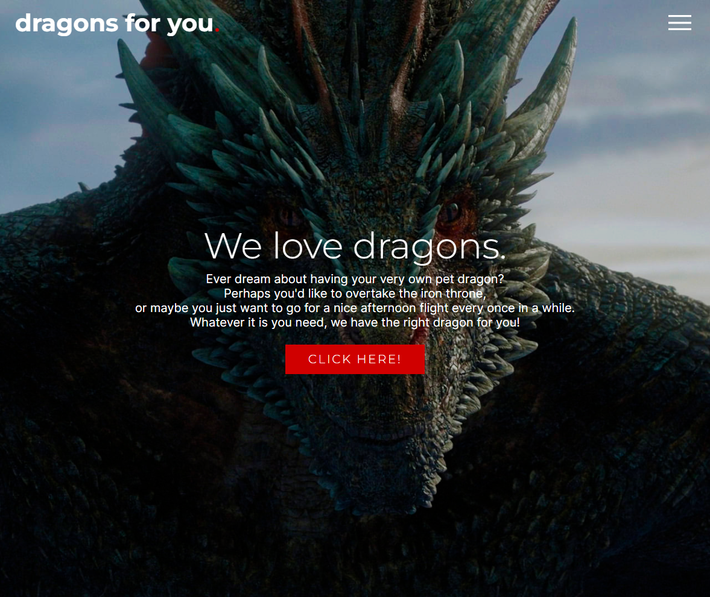

# Responsive website: dragons for you

>PT-BR

Projeto de website responsivo/mobile friendly construído a partir [deste tutorial](https://www.youtube.com/watch?v=ac5nmWOkBEY).

🔗 [Clique aqui para acessar](https://mariak-fla.github.io/dragonsforyou/)

>EN-US

Responsive/mobile friendly website project based on [this tutorial](https://www.youtube.com/watch?v=ac5nmWOkBEY).

🔗 [Click here to check it out](https://mariak-fla.github.io/dragonsforyou/)

## 🚀 Tecnologias

- HTML
- CSS
- Git
- Github
- javascript